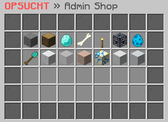

# 🛍 Adminshop

<figure><figcaption></figcaption></figure>

### Welche Möglichkeiten bietet der Adminshop?

Der Adminshop bietet dir die Möglichkeit, deine erworbenen Gegenstände gegen Geld einzutauschen, ohne direkt mit anderen Spielern zu handeln. Es ist jedoch in der Regel profitabler, direkt mit anderen Spielern zu handeln, da der Adminshop in der Regel niedrigere Preise anbietet. Daher wird empfohlen, den Adminshop nur in Notfällen oder wenn keine andere Option zur Verfügung steht, zu nutzen.

### Wie kauft man einen Gegenstand aus dem Adminshop?

Um einen Gegenstand aus dem Adminshop zu erwerben, kannst du einfach mit einem **Rechtsklick** darauf die gewünschte Anzahl auswählen, sei es nur ein einzelner, 16 oder sogar 64. Dies erleichtert dir die Verwaltung deiner Einkäufe und gewährleistet, dass du genau die Anzahl an Gegenständen erhältst, die du benötigst.

### Wie verkauft man einen Gegenstand an den Adminshop?

Um einen Gegenstand an den Adminshop zu verkaufen, kannst du einfach mit einem **Linksklick** die gewünschte Anzahl auswählen, sei es nur ein einzelner, 16 oder sogar 64. Dies vereinfacht die Verwaltung deiner Verkäufe und gibt dir die Kontrolle darüber, welche Gegenstände und in welcher Menge du verkaufen möchtest.
