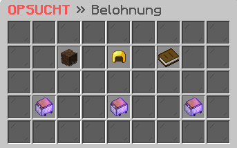

# 🪙 Belohnung

<figure><figcaption></figcaption></figure>

### Wie kann ich mein Profil einsehen?

Im Belohnungs-Interface, welches du mit dem Befehl **`/belohnungen`** aufrufen kannst, hast du Zugang zu deinem Profil. Hier siehst du deinen aktuellen Punktestand, deine aktuelle Streak sowie das Enddatum deiner Streak. Mit diesen Informationen kannst du deine Fortschritte verfolgen und dich darauf konzentrieren, deine Streak zu verlängern und noch mehr Punkte zu sammeln.

### Wie kann man Punkte verdienen?

Es gibt mehrere Möglichkeiten, Punkte zu verdienen, zum Beispiel durch das **Voten**, durch die **tägliche Belohnung** und die **tägliche Aufgabe**. Diese Systeme sind dazu da, um die Spieler zu belohnen, die aktiv und engagiert sind und helfen unserem Server zu wachsen und zu gedeihen.

### Wie kann die gesammelten Punkte einlösen?

Im Punkteshop, welcher sich im Belohnungs-Interface befindet, hast du die Möglichkeit, deine gesammelten Punkte in nützliche oder unterhaltsame Belohnungen einzutauschen. Es gibt eine breite Palette an verschiedenen Gegenständen und Boni zur Verfügung, wie zum Beispiel Vote-Kisten, Ingame-Geld, exklusive Items und mehr. So kannst du deine Erfahrung auf dem Server verbessern und dich belohnen.

### Gibt es eine Bestenliste?

Im Belohnungs-Interface hast du Zugang zur Bestenliste, wo du deine aktuelle Position sowie die Top 10 der besten Spieler einsehen kannst. Dies gibt dir die Möglichkeit, deine Leistungen mit anderen Spielern zu vergleichen und dich zu motivieren, noch höher auf der Liste zu klettern.
