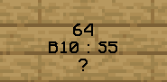
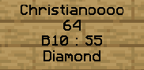

# 📦 ChestShop

<figure><figcaption></figcaption></figure>

### Wie benutzt du einen ChestShop?

Klicke einfach mit der **rechten Maustaste** auf das Schild des ChestShops, um etwas zu kaufen, und mit der **linken Maustaste**, um etwas zu verkaufen. So kannst du einfach und bequem deine Transaktionen durchführen.

### Wie erstellst du einen ChestShop?

1. Platziere eine Kiste
2. Setze ein Schild an die Kiste&#x20;
3. Beschrifte das Schild mit den gewünschten Informationen

<figure><figcaption>
ChestShop - Erstellung
</figcaption></figure>

* Freilassen
* Menge der zu verkaufenden/kaufenden Items
* B (Verkaufspreis) : S (Ankaufspreis)
* ? (Die Item-ID wird automatisch eingetragen)

<figure><figcaption>
ChestShop - Resultat
</figcaption></figure>

### Welche Befehle gibt es für den ChestShop?



**`/iteminfo`** -> Mit diesem Befehl erhältst du umfassende Informationen über das Item in deiner Hand.

**`/iteminfo <id/name>`** -> Mit diesem Befehl erhältst du Informationen über das angegebene Item.\
**`/shopinfo`** -> Mit diesem Befehl erhältst du Informationen über den aktuell betrachteten Shop.\
**`/cstoggle`** -> Mit diesem Befehl kannst du die Kauf-/Verkaufsbenachrichtigungen aktivieren oder deaktivieren.



**`/shopcreate`** -> Mit diesem Befehl kannst du einen ChestShop erstellen.

**`/iteminfo`** -> Mit diesem Befehl erhältst du umfassende Informationen über das Item in deiner Hand.

**`/iteminfo <id/name>`** -> Mit diesem Befehl erhältst du Informationen über das angegebene Item.\
**`/shopinfo`** -> Mit diesem Befehl erhältst du Informationen über den aktuell betrachteten Shop.\
**`/cstoggle`** -> Mit diesem Befehl kannst du die Kauf-/Verkaufsbenachrichtigungen aktivieren oder deaktivieren.


