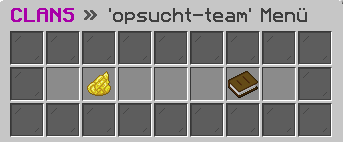

# 🌀 Clan

<figure><figcaption></figcaption></figure>

### Wie erstellt man einen Clan?

Der Befehl **`/clan erstellen <tag> <name>`** ermöglicht dir das Erstellen eines Clans. Beachte jedoch, dass hierfür eine Gebühr anfällt.

### Wie lädt man einen Spieler in den Clan ein?

Mit dem Befehl **`/clan verwalten einladen <spieler>`** hast du die Möglichkeit, einen Spieler in deinen Clan aufzunehmen.

### Wie kann ein Clan verifiziert werden?

Um die Verifizierung des Clans zu erhalten, müssen folgende Anforderungen erfüllt werden:

* Euer Clan muss aus **mindestens 20 aktiven Mitgliedern** bestehen.
* Ihr solltet **regelmäßig** auf Teamspeak oder Discord aktiv sein.
* Euer Clan benötigt **ein bebautes Plot**.
* Der Clan sollte **seit mindestens 8 Wochen** bestehen.

Es ist wichtig zu beachten, dass dies allgemeine Anforderungen sind.

### Welche Einstellungen kann man im Clan-Menü vornehmen?

Im Clan-Menü, welches über den Befehl **`/clan menü`** aufgerufen werden kann, kannst du den Status deines Clans ändern, indem du zwischen den Optionen "**Offen"**, "**Auf Einladung"** und "**Geschlossen"** wählen kannst. Außerdem hast du die Möglichkeit, die **maximale Anzahl der Clanmitglieder** gegen eine Gebühr zu erhöhen.

### Welche Befehle gibt es für das Clansystem?



**`@clan <text>`** -> Sende Nachrichten im Chat deines Clans.

**`/clan hilfe <seite>`** -> Navigiere innerhalb der Hilfe-Seiten des Clansystems.

**`/clan beitreten <tag>`** -> Trete dem gewünschten Clan bei.

**`/clan erstellen <tag> <name>`** -> Erstelle einen neuen Clan mit dem gewünschten Tag und Namen.

**`/clan verlassen`** -> Verlasse den aktuellen Clan.

**`/clan info <tag>`** -> Erhalte Informationen über den gewünschten Clan.

**`/clan mitglieder <tag>`** -> Erhalte eine Liste der Mitglieder des gewünschten Clans.

**`/clan bestenliste`** -> Erhalte die Bestenliste der Clans.

**`/clan einladung`** -> Erhalte eine Liste aller offenen Clan-Einladungen.

**`/clan einladung ablehnen <tag>`** -> Lehne die Einladung zu dem gewünschten Clan ab.

**`/clan einladung annehmen <tag>`** -> Nimm die Einladung zu dem gewünschten Clan an.

**`/clan bank auszahlen <geld>`** -> Zahle eine gewünschte Summe an Geld aus der Clan Bank aus.

**`/clan bank einzahlen <geld>`** -> Zahle eine gewünschte Summe an Geld in die Clan Bank ein.

**`/clan bank info`** -> Erhalte Informationen über die Clan Bank.

**`/clan kontoauszug <seite>`** -> Erhalte den gewünschten Kontoauszug der Clan Bank.

**`/clan verwalten beschreibung <text/entfernen>`** -> Setze oder entferne die Beschreibung des Clans.

**`/clan verwalten einladen <spieler>`** -> Lade den gewünschten Spieler zum Clan ein.

**`/clan verwalten löschen`** -> Lösche den aktuellen Clan.

**`/clan verwalten name <name>`** -> Änder den Namen des Clans.

**`/clan verwalten rauswerfen <spieler>`** -> Werfe den gewünschten Spieler aus dem aktuellen Clan.

**`/clan verwalten status <status>`** -> Änder den Status des aktuellen Clans.

**`/clan verwalten tag <tag>`** -> Änder den Tag des aktuellen Clans.

**`/clan rolle berechtigungsstufe <rolle> <berechtigungsstufe>`** -> Änder die Berechtigungsstufe der gewünschten Rolle.

**`/clan rolle editieren <rolle>`** -> Editiere die gewünschte Rolle.

**`/clan rolle erstellen <rolle> <berechtigungsstufe>`** -> Erstelle die gewünschten Rolle mit der Berechtigungsstufe.

**`/clan rolle info`** -> Erhalte Informationen über die gewünschte Rolle.

**`/clan rolle löschen <rolle>`** -> Lösche die gewünschte Rolle.

**`/clan rolle setzen <spieler> <rolle>`** -> Setze dem Spieler die gewünschte Rolle.



**`@clan <text>`** -> Sende Nachrichten im Chat deines Clans.

**`/clan hilfe <seite>`** -> Navigiere, innerhalb der Hilfe-Seiten des Clansystems.

**`/clan beitreten <tag>`** -> Tritt dem gewünschten Clan bei.

**`/clan erstellen <tag> <name>`** -> Erstelle einen neuen Clan mit dem gewünschten Tag und dem gewünschten Namen.

**`/clan verlassen`** -> Verlasse den aktuellen Clan.

**`/clan info <tag>`** -> Erhalte Informationen über den gewünschten Clan.

**`/clan mitglieder <tag>`** -> Erhalte eine Liste der Mitglieder des gewünschten Clans.

**`/clan bestenliste`** -> Erhalte die Bestenliste der Clans.

**`/clan einladung`** -> Erhalte eine Liste aller offenen Clan-Einladungen.

**`/clan einladung ablehnen <tag>`** -> Lehn die Einladung zu dem gewünschten Clan ab.

**`/clan einladung annehmen <tag>`** -> Nehme die Einladung zu dem gewünschten Clan an.

**`/clan bank auszahlen <geld>`** -> Zahle eine gewünschte Summe an Geld aus der Clan Bank aus.

**`/clan bank einzahlen <geld>`** -> Zahle eine gewünschte Summe an Geld in die Clan Bank ein.

**`/clan bank info`** -> Erhalte Informationen über die Clan Bank.

**`/clan kontoauszug <seite>`** -> Erhalte den gewünschten Kontoauszug der Clan Bank.

**`/clan verwalten beschreibung <text/entfernen>`** -> Setze oder entfernt die Beschreibung des Clans.

**`/clan verwalten einladen <spieler>`** -> Lade den gewünschten Spieler zum Clan ein.

**`/clan verwalten löschen`** -> Lösch den aktuellen Clan.

**`/clan verwalten name <name>`** -> Änder den Namen des Clans.

**`/clan verwalten rauswerfen <spieler>`** -> Werfe den gewünschten Spieler aus dem aktuellen Clan.

**`/clan verwalten status <status>`** -> Änder den Status des aktuellen Clans.

**`/clan verwalten tag <tag>`** -> Änder den Tag des aktuellen Clans.

**`/clan rolle info`** -> Erhalte Informationen über die gewünschte Rolle.

**`/clan rolle setzen <spieler> <rolle>`** -> Setze dem Spieler die gewünschte Rolle.


