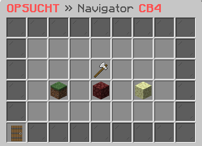

# ⚒ Farmwelt

<figure><figcaption></figcaption></figure>

### Wie kommt man in die Farmwelt?

Mit dem Befehl **`/farm`** gelangst du in die Farmwelt. Der Befehl öffnet das Navigator-Interface, welches dir alle verfügbaren Farmwelten anzeigt und dir ermöglicht, schnell und einfach zwischen ihnen zu wechseln.

### Welche Farmwelten gibt es?

Die Farmwelten "Farmwelt", "Nether" und "End" sind stets bereit für deine Ernte. Jede Welt besitzt ihre einzigartigen Eigenschaften und Herausforderungen. Vergewissere dich stets, dass du die angemessene Ausrüstung für die gewählte Welt bei dir trägst, bevor du aufbrichst, um deine Gegenstände zu erfarmen.

### Wie groß sind die Farmwelten?

Im Navigator-Interface, hast du die Möglichkeit, die Größe jeder einzelnen Farmwelt einzusehen. Dort werden dir alle verfügbaren Farmwelten, inklusive ihrer Größen und weiteren relevanten Informationen, präsentiert.

### Wann wird die Farmwelt zurückgesetzt?

Du kannst das genaue Datum einer Farmwelt-Zurücksetzung in der Bossbar, die in der jeweiligen Farmwelt angezeigt wird, einsehen. Diese Bossbar gibt dir nicht nur das Datum der nächsten Zurücksetzung an, sondern auch andere wichtige Informationen wie die verbleibende Zeit bis zur Zurücksetzung.

### Welche Befehle gibt es für die Farmwelten?



**`/randomtp`** -> Teleportiert dich an einen zufälligen Ort in der Farmwelt.



**`/randomtp`** -> Teleportiert dich an einen zufälligen Ort in der Farmwelt.


