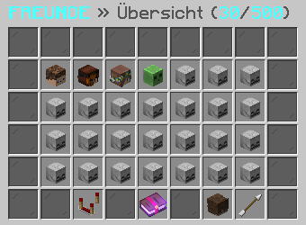

# 🧑🤝🧑 Freunde

<figure><figcaption></figcaption></figure>

### Wie fügt man einen Freund hinzu?

Du kannst mit dem Befehl **`/freund hinzufügen <name>`** eine Freundschaftsanfrage an einen Spieler deiner Wahl senden. Die Freundschaftsanfragen können mit dem Befehl **`/freund akzeptieren <name>`** angenommen oder mit **`/freund ablehnen <name>`** abgelehnt werden. Im Freunde-Interface, welches mit dem Befehl **`/freund`** aufgerufen werden kann, kann man ebenfalls Freundschaftsanfragen annehmen oder ablehnen.

### Wie entfernt man einen Freund?

Du kannst mit dem Befehl **`/freund entfernen <name>`** die Freundschaft mit einem bestimmten Spieler auflösen.

### Welche Privatsphäre-Einstellungen gibt es?

Du kannst mit dem Befehl **`/freund privatsphäre`** die Privatsphäre-Einstellungen aufrufen. Dort hast du die Möglichkeit einzustellen, wer dir Nachrichten senden kann, wem du mit `/r` antwortest, wenn du mit mehreren Spielern eine Konversation führst, ob du Freundschaftsanfragen erhalten kannst, ob du Benachrichtigungen erhältst, wenn einer deiner Freunde den Server betritt oder verlässt und ob du Benachrichtigungen erhältst, wenn einer deiner Freunde den Server wechselt.

### Welche Befehle gibt es für das Freunde-System?



**`/freund`** -> Öffnet das Freunde-Interface.

**`/freund anfragen`** -> Zeigt dir alle offenen Freundschaftsanfragen an.

**`/freund hinzufügen <name>`** -> Sendet einem anderen Spieler eine Freundschaftsanfrage.

**`/freund entfernen <name>`** -> Löst die Freundschaft mit einem bestimmten Spieler auf.

**`/freund akzeptieren <name>`** -> Akzeptiert die Freundschaftsanfrage eines anderen Spielers.

**`/freund ablehnen <name>`** -> Lehnt die Freundschaftsanfrage eines anderen Spielers ab.

**`/freund privatsphäre`** -> Öffnet die Privatsphäre-Einstellungen.



In der Bedrock Edition stehen derzeit keine Befehle zur Verfügung, um das Freunde-System zu verwalten.


