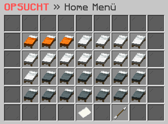

# 📍 Home

<figure><figcaption></figcaption></figure>

### Wie erstellst du ein Home?

Mit dem Befehl **`/home create <name>`** kannst du ein Home erstellen und es mit einem bestimmten Namen versehen. So kannst du später schneller und einfacher zu diesem Ort teleportiert werden. Du kannst mehrere Homes erstellen und jedem einen eigenen Namen geben, um sie besser unterscheiden zu können.

### Wie kaufst du ein weiteres Home?

Mit dem Befehl **`/home create <name>`** kannst du ein Home erstellen. Im Home-Interface, welches du mit dem Befehl **`/home`** aufrufen kannst, hast du die Möglichkeit, weitere Homes für eine bestimmte Summe zu kaufen. So kannst du dir individuelle Orte innerhalb des Spiels sichern, an die du dich jederzeit teleportieren kannst.

### Wie löscht du ein Home?

Mit dem Befehl **`/home delete <name>`** kannst du ein bestimmtes Home löschen, das du zuvor erstellt hast. Auf diese Weise kannst du überflüssige oder ungenutzte Homes entfernen und Platz für neue Homes schaffen.

### Welche Befehle gibt es für die Homes?



**`/home`** -> Öffnet das Home-Interface, über welches du Zugriff auf deine erstellten Homes und die Möglichkeit hast, weitere Homes zu erwerben hast.

**`/home <name>`** -> Teleportiert dich zu einem bestimmten Home, welches du vorher erstellt hast.

**`/home help`** -> Zeigt dir eine Liste aller verfügbaren Befehle im Zusammenhang mit dem Home-System.

**`/home update <name>`** -> Aktualisiert die Position deines gewählten Homes.

**`/home create <name>`** -> Erstellt einen neuen Home mit dem angegebenen Namen.

**`/home delete <name>`** -> Löscht einen bestehenden Home mit dem angegebenen Namen.

**`/home list`** -> Zeigt dir eine Liste aller derzeit von dir erstellten Homes und deren aktuelle Positionen.



**`/home`** -> Öffnet das Home-Interface, über welches du Zugriff auf deine erstellten Homes und die Möglichkeit hast, weitere Homes zu erwerben hast.

**`/home <name>`** -> Teleportiert dich zu einem bestimmten Home, welches du vorher erstellt hast.

**`/home help`** -> Zeigt dir eine Liste aller verfügbaren Befehle im Zusammenhang mit dem Home-System.

**`/home update <name>`** -> Aktualisiert die Position deines gewählten Homes.

**`/home create <name>`** -> Erstellt einen neuen Home mit dem angegebenen Namen.

**`/home delete <name>`** -> Löscht einen bestehenden Home mit dem angegebenen Namen.

**`/home list`** -> Zeigt dir eine Liste aller derzeit von dir erstellten Homes und deren aktuelle Positionen.


