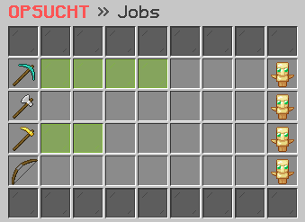

# 💸 Job

<figure><figcaption></figcaption></figure>

### Wie funktionieren die Jobs?

Jeder Job in den Farmwelten ermöglicht es dir, deine Fähigkeiten unter Beweis zu stellen und Geld zu verdienen. Durch das Erreichen höherer Job-Levels kannst du deinen Verdienst steigern und dich in der Rangliste der besten Arbeiter platzieren. So kannst du deine Leistungen im Job verbessern und dich gegenüber anderen Spielern behaupten. Um dein Job-Level zu erhöhen und Geld zu verdienen, musst du je nach Job bestimmte Blöcke erfolgreich abbauen.

### Welche Jobs gibt es?

Es stehen eine Vielfalt an Berufen zur Verfügung, darunter **Minenarbeiter**, **Holzfäller**, **Gräber** und **Jäger**. Der Spieler hat die Freiheit, sich für mehrere Berufe gleichzeitig zu entscheiden und so seine Erfahrungen und Fähigkeiten zu erweitern, anstatt sich auf einen einzigen Beruf zu beschränken.

### Wie kann man die Jobinformation einsehen?

Im Job-Interface, welches du mit dem Befehl **`/jobs`** aufrufen kannst, hast du die Möglichkeit, den Fortschritt und die Leistungen deiner ausgewählten Berufe zu verfolgen. Durch das Anklicken eines bestimmten Jobs erhältst du detaillierte Informationen wie die **Job-XP pro Block**, den **aktuellen Fortschritt**, das **Job-Level** und die **Vergütung pro Block**. So hast du stets einen Überblick über deine beruflichen Fortschritte und kannst gezielte Entscheidungen treffen.

### Gibt es eine Bestenliste?

Im Job-Interface kannst du für jeden Job die Bestenliste einsehen, die deine aktuelle Position und die Top 5 der besten Spieler des Jobs anzeigt. So hast du die Möglichkeit, deine Leistungen mit denen der anderen Spieler zu vergleichen und dich mit ihnen zu messen.
