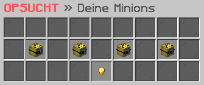

# ⛏ Minion

<figure><figcaption></figcaption></figure>

### Wie schickt man ein Minion arbeiten?

Im Minion-Interface, welches du mit dem Befehl **`/minion`** aufrufen kannst, hast du die Möglichkeit, Minions zu besitzen und zu steuern. Hier kannst du Minions für einen bestimmten Preis entsenden, um bestimmte Aufgaben für dich auszuführen, wie zum Beispiel das Abbauen von Ressourcen oder das Ernten von Pflanzen. Du kannst auch deine vorhandenen Minions verwalten und upgraden, um ihre Fähigkeiten und Effizienz zu verbessern.

### Welche Minions stehen zur Verfügung?

Im Minion-Interface stehen dir verschiedene Arten von Minions zur Verfügung, die du für bestimmte Aufgaben einsetzen kannst. Dazu gehören Minenarbeiter, die Ressourcen abbauen, Netherarbeiter, die im Nether Ressourcen abbauen, Gräber, die Schätze suchen und Holzfäller, die Bäume fällen. Jeder Minion hat seine eigenen Fähigkeiten und Kosten, also solltest du sorgfältig auswählen, welche Minions am besten für deine Bedürfnisse geeignet sind.

### Wie kann man einen Minion upgraden?

Wenn du einen Minion rechtsklickst, hast du die Möglichkeit, ihn gegen eine bestimmte Summe an ausgewählten Gegenständen und Geld zu upgraden. Diese Upgrades können die Leistung, Geschwindigkeit und Kapazität des Minions verbessern, um dir bei deinen Aufgaben noch effektiver zu helfen.

### Gibt es eine Bestenliste?

Im Minion-Interface kannst du nicht nur deine Minions verwalten, sondern auch die Bestenliste einsehen. Diese gibt dir Informationen über den besten Minion, einschließlich Platz, Level und Typ. Du hast auch die Möglichkeit, die Bestenliste nach Typ zu filtern, um die Minions von anderen Spielern nach **Minenarbeitern**, **Netherarbeitern**, **Gräbern** oder **Holzfällern** zu sortieren.
