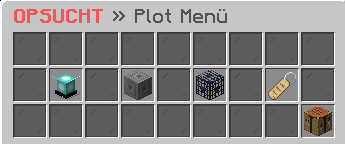

# 🏠 Grundstück

<figure><figcaption></figcaption></figure>

### **Wie** erhältst **du ein Grundstück?**

Ein Grundstück kannst du auf zwei Arten erhalten. Entweder bekommt du es automatisch über den Befehl **`/p auto`** zugewiesen, oder du beanspruchst dir ein freies Grundstück mit dem Befehl **`/p claim`**. Jeder Spieler kann standardmäßig **mindestens 4 Grundstücke** besitzen. Wer mehr Plots benötigt, kann diese im **Plot-Shop** erwerben, welcher über den Befehl **`/plot shop`** aufrufbar ist.

### Welche Einstellungen kannst du im Plot-Menü vornehmen?

Im Plot-Menü, welches über den Befehl **`/plot`** aufgerufen werden kann, kannst du diverse Einstellungen vornehmen. Dazu gehört die Möglichkeit, seinen **Rand einzustellen**, seine **Wand einzustellen**, die Plot Caps wie z.B. die **Hopper-Flag aktualisieren** und einen **Plot-Titel** festlegen.

### Wie erhältst du Informationen über ein Grundstück?

Um Informationen über ein Grundstück zu erhalten, kannst du den Befehl **`/p i`** verwenden. Mit diesem Befehl erhältst du verschiedene Informationen, wie zum Beispiel die **ID**, das **Erstellungsdatum**, den **Alias**, den **Besitzer**, das **Biom**, die Liste der **vertrauten** und **verbotene** Mitglieder sowie die aktuellen **Flags** des Grundstücks.

### Wie kannst du einem anderen Spieler Rechte auf deinem Grundstück erteilen?

Um einem anderen Spieler Rechte auf deinem Grundstück zu erteilen, gibt es mehrere Optionen. Eine Möglichkeit ist, den Spieler mit dem Befehl **`/p add <player>`** als Mitglied hinzuzufügen. Als Mitglied kann er nur auf dem Grundstück interagieren, wenn der Besitzer online ist. Eine weitere Möglichkeit ist es, den Spieler mit dem Befehl **`/p trust <player>`** zu vertrauen, damit er jederzeit auf dem Grundstück interagieren kann, unabhängig davon, ob der Besitzer online ist.

### Wie kannst du einen anderen Spieler vom Grundstück verweisen?

Um einen anderen Spieler vom eigenen Grundstück zu verweisen, gibt es mehrere Möglichkeiten. Eine Möglichkeit ist es, den Spieler temporär mit dem Befehl **`/p kick <player>`** von dem Grundstück zu entfernen. Eine andere Möglichkeit ist, den Spieler dauerhaft mit dem Befehl **`/p deny <player>`** vom Grundstück zu verweisen.

### Wie verbindest du mehrere Grundstücke miteinander?

Um mehrere Grundstücke miteinander zu verbinden, kannst du den Befehl **`/p merge`** verwenden. Um alle Grundstücke in unmittelbarer Nähe miteinander zu verbinden, müssen sie alle den Standardrand haben und man muss den Befehl **`/p merge all`** ausführen. Diese Aktion kann nur durch den Befehl **`/p unlink`** rückgängig gemacht werden, jedoch werden dabei alle verbundenen Grundstücke getrennt und alles, was sich auf der Fläche der Straße befindet, wird verloren gehen.

### **Wie kannst du ein Grundstück leeren?**

Um ein Grundstück zu leeren, kannst du den Befehl **`/p clear`** verwenden. Dieser Befehl entfernt alle Gebäude und Gegenstände auf dem Grundstück. Es ist jedoch zu beachten, dass diese Aktion nicht rückgängig gemacht werden kann und das Grundstück nicht gelöscht wird. Um das Grundstück komplett zu löschen, kann man den Befehl **`/p delete`** verwenden, jedoch ist auch diese Aktion endgültig und kann nicht rückgängig gemacht werden.

### Welche Befehle gibt es für das Plot-System?



**`/plot`** -> Öffnet das Plot-Interface.

**`/plot auto`** -> Weist automatisch ein freies Grundstück zu.

**`/plot claim`** -> Beansprucht ein freies Grundstück.

**`/plot home`** -> Teleportiert dich zu deinem Grundstück.

**`/plot shop`** -> Öffnet den Plot-Shop.

**`/plot middle`** -> Teleportiert dich in die Mitte des aktuellen Grundstücks.

**`/plot visit <player>`** -> Teleportiert dich zum Grundstück eines anderen Spielers.

**`/plot info`** -> Zeigt Informationen zum aktuellen Grundstück.

**`/plot list [mine, shared <player>]`** -> Listet alle Grundstücke auf, die man besitzt.

**`/plot caps`** -> Zeigt die Auslastung deiner Caps.

**`/plot clear`** -> Leert das aktuelle Grundstück.

**`/plot delete`** -> Löscht das aktuelle Grundstück.

**`/plot add <player>`** -> Fügt einen Spieler als Mitglied zum aktuellen Grundstück hinzu.

**`/plot trust <player>`** -> Vertraut einem Spieler das aktuelle Grundstück an.

**`/p remove <player>`** -> Entfernt einen Spieler vom aktuellen Grundstück.

**`/plot kick <player>`** -> Kickt einen Spieler vom aktuellen Grundstück.

**`/plot deny <player>`** -> Verweist einen Spieler dauerhaft vom aktuellen Grundstück.

**`/plot merge`** -> Verbindet das aktuelle Grundstück mit einem benachbarten Grundstück.

**`/plot unlink`** -> Trennt verbundene Grundstücke voneinander.

_**Dies ist nur eine Auswahl der häufig verwendeten Befehle.**_



**`/plot`** -> Öffnet das Plot-Interface.

**`/plot menü`** -> Öffnet das Plot-Menü

**`/plot auto`** -> Weist automatisch ein freies Grundstück zu.

**`/plot claim`** -> Beansprucht ein freies Grundstück.

**`/plot home`** -> Teleportiert dich zu deinem Grundstück.

**`/plot shop`** -> Öffnet den Plot-Shop.

**`/plot middle`** -> Teleportiert dich in die Mitte des aktuellen Grundstücks.

**`/plot visit <player>`** -> Teleportiert dich zum Grundstück eines anderen Spielers.

**`/plot info`** -> Zeigt Informationen zum aktuellen Grundstück.

**`/plot list [mine, shared <player>]`** -> Listet alle Grundstücke auf, die man besitzt.

**`/plot caps`** -> Zeigt die Auslastung deiner Caps.

**`/plot clear`** -> Leert das aktuelle Grundstück.

**`/plot delete`** -> Löscht das aktuelle Grundstück.

**`/plot add <player>`** -> Fügt einen Spieler als Mitglied zum aktuellen Grundstück hinzu.

**`/plot trust <player>`** -> Vertraut einem Spieler das aktuelle Grundstück an.

**`/p remove <player>`** -> Entfernt einen Spieler vom aktuellen Grundstück.

**`/plot kick <player>`** -> Kickt einen Spieler vom aktuellen Grundstück.

**`/plot deny <player>`** -> Verweist einen Spieler dauerhaft vom aktuellen Grundstück.

**`/plot merge`** -> Verbindet das aktuelle Grundstück mit einem benachbarten Grundstück.

**`/plot unlink`** -> Trennt verbundene Grundstücke voneinander.

_**Dies ist nur eine Auswahl der häufig verwendeten Befehle.**_


