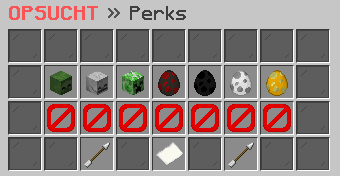

# ✨ Perks

<figure><figcaption></figcaption></figure>

### Welche Perks gibt es?

Eine aktuelle Übersicht über alle verfügbaren Perks erhältst du im Perks-Interface, welches du mit dem Befehl **`/perks`** aufrufen kannst. Hier kannst du dir auch die spezifischen Vorteile jedes Perks ansehen.

### Wie erhält man einen Perk?

Du hast die Möglichkeit, Perks entweder durch den Erwerb eines bestimmten Ranges oder durch das Öffnen von Kisten zu erhalten.

### Wie aktiviert man einen Perk?

Jedes freigeschaltete Perk kann im Perks-Interface aktiviert werden. Du hast auch die Möglichkeit, deine aktivierten Perks zu deaktivieren oder einzusehen, welche Perks du noch nicht freigeschaltet hast.
