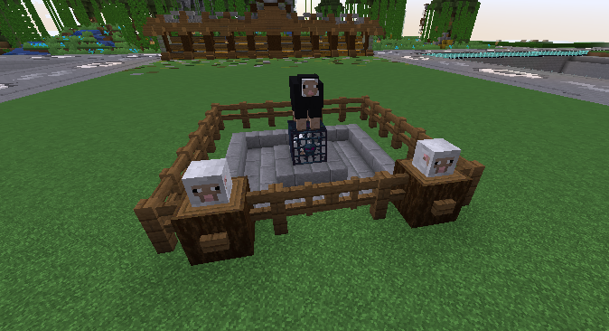

# 🐷 Spawner

<figure><figcaption></figcaption></figure>


Im Umgang mit Spawnern gibt es die Möglichkeit, sowohl passive als auch aktive Spawner zu nutzen. Solltest du noch einen aktiven Spawner besitzen, kannst du ihn durch einen Rechtsklick abbauen. Dadurch erhältst du sowohl den Spawner selbst als auch das darin befindliche Spawn-Ei zurück.


### Wie benutzt man einen Spawner?

Man kann mit einem Rechtsklick auf einen Spawner das Interface des Spawners öffnen. In diesem kannst du ein oder mehrere Spawn-Eier hineinlegen, um den Spawner zu aktivieren. Der Loot wird im Speicher des Spawners gesammelt. Du kannst die Items mit einem Linksklick einzeln entnehmen oder mehrere auf einmal durch einen Rechtsklick abholen.

### Wie kann man einen Spawner upgraden?

Du kannst einen Spawner upgraden, indem du auf die roten Glasscheiben klickst und weitere Slots erwirbst. Diese ermöglichen dir, weitere Spawn-Eier in den Spawner zu legen und so seine Kapazität und Leistung zu erhöhen. Beispielsweise kannst du so die maximale Anzahl von Mobs erhöhen, den Item-Speicher erweitern und mehr Mobs pro Spawn-Ei erhalten.

### Wie kann man ein Mob drehen?

Mit dem Spawner-Interface kannst du nicht nur die Anzahl der Mobs erhöhen, indem du weitere Slots für Spawn-Eier freischaltest, sondern auch den Blickwinkel des Mobs verändern. Durch einen Linksklick kannst du den Mob um +45 Grad drehen, durch einen Rechtsklick um -45 Grad. So hast du die Möglichkeit, die Anzeige des Mobs an deine Wünsche anzupassen.

### Wie kann man den Zugriff des Spawners einstellen?

Im Spawner-Interface kannst du die Zugriffseinstellungen für das Inventar und das Angreifen individuell festlegen. Für das Inventar stehen dir die Optionen Besitzer, Trust und Add zur Verfügung, während du für das Angreifen zwischen den Optionen Alle, Besitzer, Trust und Add wählen kannst. Mit diesen Einstellungen hast du die volle Kontrolle darüber, wer Zugriff auf deinen Spawner hat und wer die Mobs angreifen darf.

### Wie kann man die Lebensanzeige de/aktivieren?

Dies kann durch einen Klick auf die entsprechende Schaltfläche im Spawner-Interface erfolgen. Auf diese Weise kannst du jederzeit schnell und einfach die Lebensanzeige de/aktivieren, je nach deinen aktuellen Bedürfnissen und Anforderungen.

### Gibt es eine Übersicht für jenes Mob?

Im Spawner-Interface gibt es eine Übersicht für jeden Mob, die dir Informationen wie die Stackrate geben.

### Wie kann man einen Spawner abbauen?

Wenn du einen Spawner abbauen möchtest, kannst du dies im Spawner-Interface tun. Dazu musst du den Spawner rechtsklicken und die Option "Spawner abbauen" auswählen. Es ist wichtig zu beachten, dass du vor dem Abbauen sicherstellen musst, dass alle Spawn-Eier aus dem Spawner entfernt wurden, da diese sonst verloren gehen. Beachte, dass eine gewisse Summe an Kosten anfallen kann.
