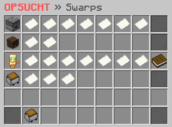

# 📌 Swarp

<figure><figcaption></figcaption></figure>

### Wie erstellst du einen Swarp?

Du kannst mit dem Befehl **`/swarp create <name>`** einen Swarp erstellen. Dieser Befehl ermöglicht es dir, einen schnellen Teleportationspunkt an einem Ort deiner Wahl zu erstellen. Beachte jedoch, dass du Swarps nur auf Straßen oder auf Grundstücken erstellen kannst, die dir gehören oder auf denen du die Erlaubnis hast, einen Swarp zu erstellen.

### Wie löscht du einen Swarp?

Mit dem Befehl **`/swarp delete <name>`** hast du die Möglichkeit, einen bereits erstellten Swarp zu löschen. Stelle sicher, dass du den Swarp löschen möchtest, da dieser Vorgang nicht rückgängig gemacht werden kann. Beachte, dass nur der Ersteller oder ein Administrator einen Swarp löschen kann.

### Welche Befehle gibt es für die Swarps?



**`/swarp create <name>`** -> Erstellt einen Swarp an deiner aktuellen Position.\
**`/swarp delete <name>`** -> Löscht einen Swarp.\
**`/swarp update <name>`** -> Aktualisiert die Position eines Swarps auf deine aktuelle Position.\
**`/swarp list`** -> Zeigt eine Liste aller von dir erstellten Swarps an.\
**`/swarp info <name>` ** -> Gibt dir detaillierte Informationen über einen bestimmten Swarp, wie zum Beispiel den Inhaber, das Erstellungsdatum und die genaue Position.



**`/swarp create <name>`** -> Erstellt einen Swarp an deiner aktuellen Position.\
**`/swarp delete <name>`** -> Löscht einen Swarp.\
**`/swarp update <name>`** -> Aktualisiert die Position eines Swarps auf deine aktuelle Position.\
**`/swarp list`** -> Zeigt eine Liste aller von dir erstellten Swarps an.\
**`/swarp info <name>` ** -> Gibt dir detaillierte Informationen über einen bestimmten Swarp, wie zum Beispiel den Inhaber, das Erstellungsdatum und die genaue Position.


