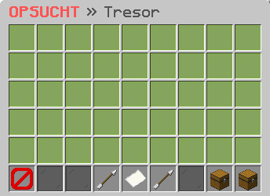

# 🗄 Tresor

<figure><figcaption></figcaption></figure>


Aktuell ist dieses Feature ausschließlich für die Java-Edition verfügbar.


### Wie funktioniert der Tresor?

Auf jedem CityBuild Server hast du die Möglichkeit, deinen Tresor mit dem Befehl **`/tresor` ** aufzurufen. Abhängig von deinem Rang stehen dir dort mehrere Seiten zur Verfügung, auf denen du deine Items aufbewahren kannst. Dies ermöglicht dir, deine wertvollen Gegenstände sicher aufzubewahren und das Risiko von Diebstahl zu minimieren.

### Kann man alle Items auf einmal entnehmen?

Im Tresor-Interface hast du die Möglichkeit, alle deine Gegenstände aus deinem Tresor zu entnehmen, indem du auf die Kiste mit der Beschriftung "Alle Items entnehmen" klickst. Dies ermöglicht es dir, alle deine Gegenstände schnell und einfach auf einmal aus deinem Tresor zu entnehmen, anstatt sie einzeln zu entnehmen.

### Kann man alle Items auf einmal verwahren?

Im Tresor-Interface hast du die Möglichkeit, deine gesamten Besitztümer aus deinem Inventar sicher und bequem aufzubewahren. Durch einfaches Klicken auf die Schaltfläche mit der Bezeichnung "Alle Items verwahren", kannst du alle Gegenstände auf einmal verstauen, anstatt sie einzeln hinzuzufügen. Dies spart Zeit und macht das Verwalten deiner Besitztümer einfacher denn je.
