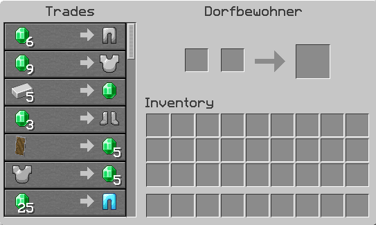

# 💼 Village

<figure><figcaption></figcaption></figure>

### Wie erstellst du ein Village?

Ein Village kann im Village-Interface, welches mit dem Befehl **`/village`** aufgerufen werden kann, erstellt werden. Dazu werden jedoch ein **Spawner** und ein **Dorfbewohner-Spawn-Ei** benötigt. Im Interface hast du die Möglichkeit, die Anzahl der Dorfbewohner zu definieren, die im Village leben sollen.

### Wie generierst du einen neuen Dorfbewohner?

Im Village-Interface kannst du einen neuen Dorfbewohner generieren. Dabei hast du die Wahl zwischen einem zufällig generierten Dorfbewohner, welcher 10 Emeralds kostet, oder einer bestimmten Kategorie, welche 30 Emeralds kostet. Du kannst die gewünschte Kategorie durch Rechtsklick auswählen und durch Linksklick wird dann ein Dorfbewohner generiert.

### Wie kannst du ein Village zurücksetzen?

Im Village-Interface kannst du durch Zugriff auf die Einstellungen dein Dorf zurücksetzen. Dies ermöglicht es dir, den **Spawner** und das **Dorfbewohner-Spawn-Ei** zurückzuerhalten. Jedoch werden bei diesem Vorgang **alle Dorfbewohner**, die sich im Village befinden, entfernt.
