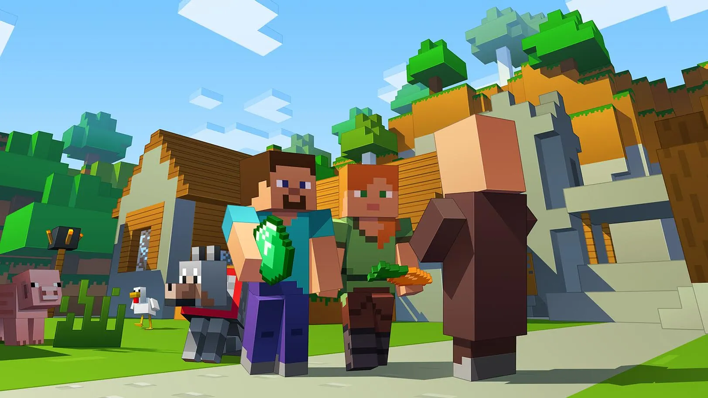

# ℹ Information

### Was sind Ränge?

Unsere Ränge bieten dir exklusive Features auf unseren Netzwerken. Mit jedem höheren Rang kommen gewisse Features dazu und sie kosten unterschiedlich viel. Der erworbene Rang ist auf dem gesamten Netzwerk nutzbar, jedoch auf die jeweilige Edition (Java oder Bedrock) beschränkt.

### Was sind Kristalle?

Kristalle sind eine Art virtuelle Währung, die verwendet werden kann, um auf unserem Netzwerk verschiedene Kisten zu erwerben. Jede Kiste hat unterschiedliche Inhalte und unterscheiden sich dementsprechend auch in ihren Wert in Kristalle. Die Kristalle können auf dem CityBuild deiner Wahl eingesetzt werden, um die Kiste zu öffnen und die darin enthaltenen Gegenstände zu erhalten.

### Welche Zahlungsmethoden stehen dir zur Auswahl?

Auf der Checkout-Seite unseres Zahlungsanbieters stehen verschiedene Zahlungsmethoden zur Auswahl. Dazu können zum Beispiel Kreditkarten, PayPal, Sofortüberweisung, Giropay, Paysafecard, Banküberweisung, u.a. gehören. Es kann sein, dass je nach Land und Region unterschiedliche Zahlungsmethoden verfügbar sind. Es empfiehlt sich, auf der Checkout-Seite unseres Zahlungsanbieters nachzusehen, welche Zahlungsmethoden in deinem Land/deiner Region verfügbar sind.

### Wann erhältst du dein gekauftes Produkt?

Sobald die Zahlung erfolgreich abgeschlossen ist, solltest du das gekaufte Produkt innerhalb von 24 Stunden erhalten. In manchen Fällen kann es jedoch aufgrund von Wartungsarbeiten oder technischen Problemen zu Verzögerungen kommen. Solltest du das gekaufte Produkt nicht innerhalb von 24 Stunden erhalten, kontaktiere bitte unseren [Shop-Support](mailto:support@iwmedia.de), damit das Problem schnellstmöglich gelöst werden kann.
